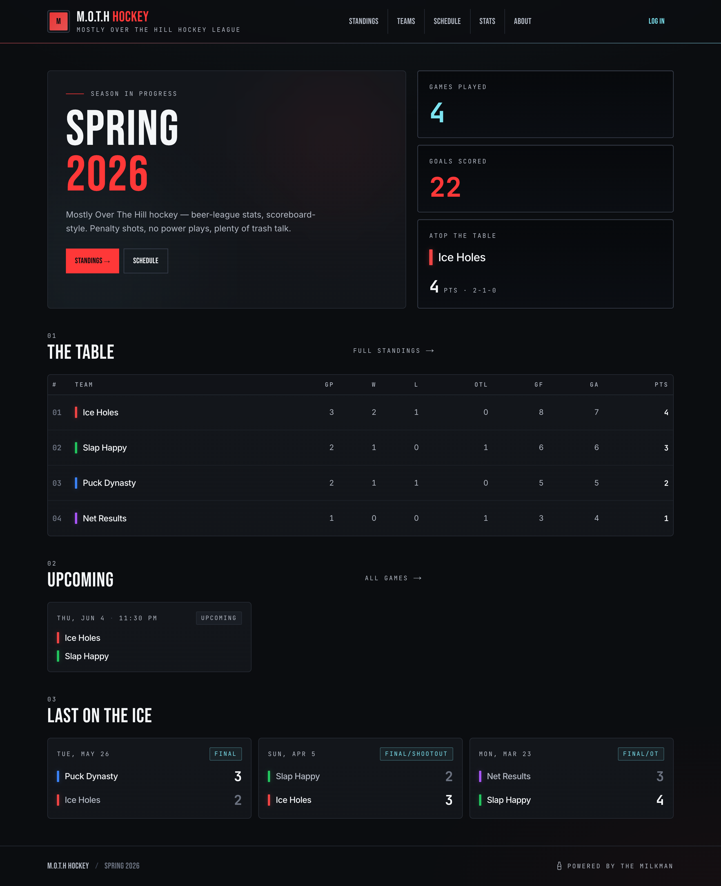
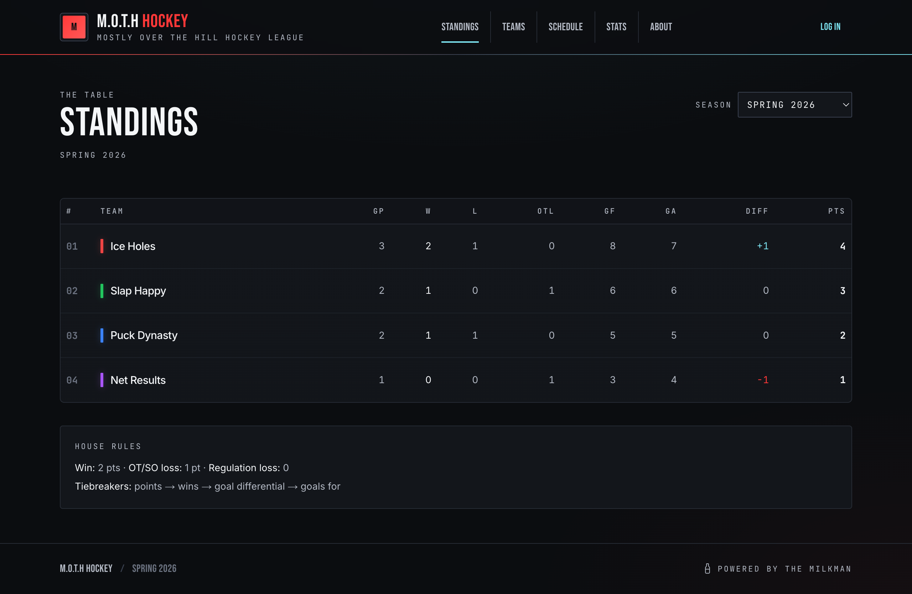
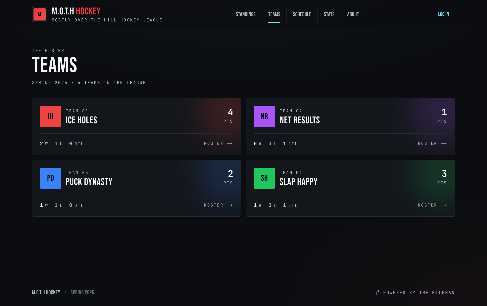
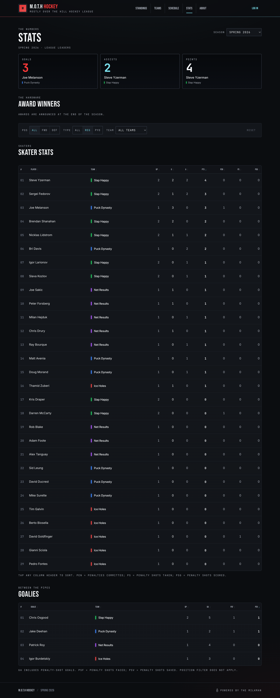
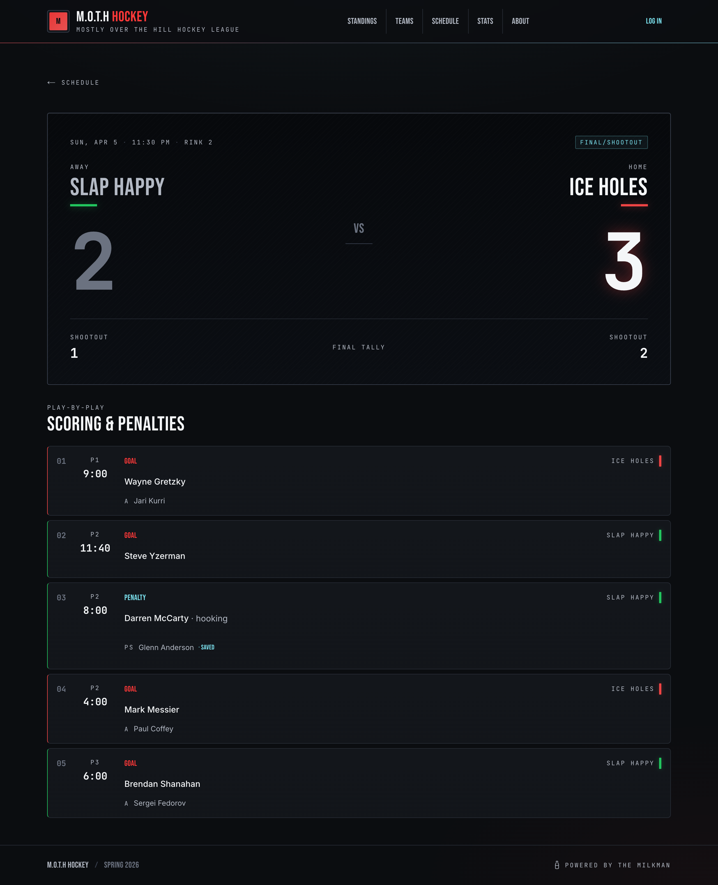
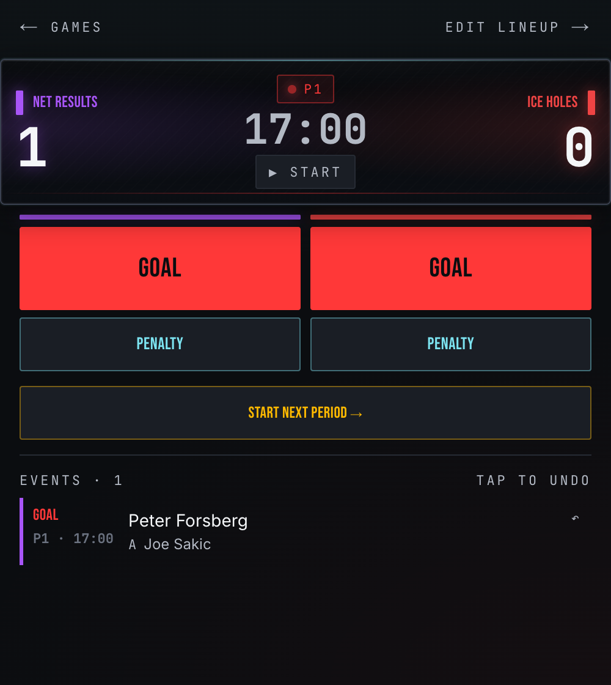

# M.O.T.H Hockey

## Overview

**M.O.T.H Hockey** ("Mostly Over The Hill") is a purpose-built league-management web app for one
recreational ("beer league") hockey league. It gives everyone public scores, standings, and stats,
while the people who run the league get live scoring and admin tooling behind a login.

It is **mobile-first** by design — most users are on a phone at the rink, on the bench, or between
shifts — with a dark "scoreboard" look and per-team accent colors. Pages are server-rendered from
Supabase, and player/goalie stats are derived at query time from the game event log rather than
stored as aggregates. _Powered by the Milkman._

🏒 **Live (staging):** [moth-hockey.vercel.app](https://moth-hockey.vercel.app/)



## Features

### Public (no login)

| Feature             | What it does                                                                                     |
| ------------------- | ------------------------------------------------------------------------------------------------ |
| **Standings**       | 2-1-0 points (win=2, OT/SO loss=1, regulation loss=0) with full tiebreakers (pts → wins → goal differential → goals for). |
| **Teams & rosters** | Per-team roster grouped by forwards / defense / goalies, plus team stats, schedule, and a captain badge. |
| **Schedule**        | Full season schedule, filterable by team and grouped by month.                                   |
| **Boxscores**       | Live or final, with a goal and penalty-shot event log, including OT and shootout.                |
| **Player profiles** | Career stats per season plus all-time totals, interactive award badges, and captain history.     |
| **League leaders**  | Points, goals, assists, penalties, and goalie stats.                                             |
| **Content pages**   | Markdown-powered rules, FAQ, and league info, editable by admins.                                |

### Scorekeeper

| Feature             | What it does                                                                                     |
| ------------------- | ------------------------------------------------------------------------------------------------ |
| **Roster check-in** | Pre-game check-in of who's playing, including adding subs.                                        |
| **Live scoring**    | Mobile-first scoring UI with a sticky running clock and GOAL / PENALTY-SHOT flows, each with UNDO. |
| **OT & shootout**   | Sudden-death overtime and shootout sub-flows.                                                    |
| **Finalize**        | Lock a game once it's complete. Finalized games can no longer be edited by scorekeepers.          |

### Captain

| Feature               | What it does                                                                  |
| --------------------- | ----------------------------------------------------------------------------- |
| **Contact directory** | Email and phone for every rostered player, grouped by team.                   |

### Admin

| Feature                | What it does                                                                  |
| ---------------------- | ----------------------------------------------------------------------------- |
| **League data CRUD**   | Create and edit teams, players, rosters, and the schedule.                    |
| **Season management**  | Round-robin generation, season activation, and playoff seeding.               |
| **Content & awards**   | Edit the markdown content pages and assign per-season player awards.          |
| **Users & roles**      | Link signups to players and assign roles (scorekeeper, admin, etc.).          |
| **Edit finalized games** | Correct events on games scorekeepers have already locked.                    |

## League rules (baked in)

This league doesn't play standard hockey, and the data model reflects that:

- A penalty results in a **penalty shot**, not a power play — no PIM.
- Regulation is **3 periods of 17 minutes running time** (the clock doesn't stop for whistles).
- Tied games go to a **5-minute sudden-death overtime**, then a **shootout**.
- Shootout goals and saves are tracked separately and **don't count toward player stats**.

## Roles

Auth is passwordless **magic-link** only — players sign in once or twice a season.

| Role           | How it's assigned                       | Can do                                                                          |
| -------------- | --------------------------------------- | ------------------------------------------------------------------------------- |
| `player`       | Default for every signup                | Browse public pages; edit own profile.                                          |
| `team_captain` | Derived from the `team_captains` table  | All player abilities + the contact directory; contact info shown on profiles.   |
| `scorekeeper`  | Assigned by an admin                    | All player abilities + live scoring (`/score`). Cannot edit finalized games.    |
| `admin`        | First one promoted by hand; rest via UI | Everything — full CRUD, season management, awards, and role assignment.          |

Contact info (email/phone) is never exposed on public pages; RLS limits reads to self, admins, and captains.

## Tech stack

- **Next.js 16.2.6** (App Router) + **React 19.2.4** — server-first React Server Components.
- **TypeScript** — path alias `@/*` → repo root.
- **Tailwind v4** — configured in `app/globals.css`, not `tailwind.config.*`.
- **Supabase** — Postgres + Auth (+ Realtime).
- **bun** — package manager and runtime.
- Deployed on **Vercel + Supabase cloud** (free tiers, ~$0/month).

> Next.js 16 and React 19 have breaking changes vs. older versions. See [`CLAUDE.md`](CLAUDE.md) and [`docs/ARCHITECTURE.md`](docs/ARCHITECTURE.md) before writing code.

## Getting started

Requires [bun](https://bun.sh) and the [Supabase CLI](https://supabase.com/docs/guides/cli) (run via `bunx`).

```bash
bun install
bunx supabase start      # local Postgres + Auth + Mailpit
bunx supabase db reset   # apply migrations + reseed the test users
bun dev                  # http://localhost:3000
```

Sign in with a magic link: open [`/login`](http://localhost:3000/login), enter one of the seeded
emails below, then open Mailpit at [http://localhost:54324](http://localhost:54324) and click the link.
`supabase db reset` recreates these accounts every time.

| Email                   | Role          |
| ----------------------- | ------------- |
| `admin@moth.test`       | `admin`       |
| `scorekeeper@moth.test` | `scorekeeper` |
| `player@moth.test`      | `player`      |

See [`docs/LOCAL-TESTING.md`](docs/LOCAL-TESTING.md) for full local dev and testing details.

## Commands

- `bun dev` — start the dev server
- `bun run build` — production build
- `bun start` — run the production build
- `bun run lint` — ESLint

No test runner is configured.

## Screenshots

|                          Standings                          |                       Teams                       |
| :---------------------------------------------------------: | :-----------------------------------------------: |
|                |               |
|                       **League leaders**                    |               **Boxscore (shootout)**             |
|                       |         |

**Live scoring (mobile)** — the scorekeeper's one-handed scoring view: running clock, per-team GOAL / PENALTY-SHOT controls, and a tap-to-undo event log.

<p align="center">
  
</p>

## Documentation

Project docs live in [`docs/`](docs/README.md):

- [ARCHITECTURE.md](docs/ARCHITECTURE.md) — stack, directory layout, data flow, Supabase client split, auth & roles.
- [DATABASE.md](docs/DATABASE.md) — schema, enums, RLS, helper functions, and triggers.
- [DEVELOPMENT.md](docs/DEVELOPMENT.md) — dev workflow, the Supabase migrations loop, and conventions.
- [LOCAL-TESTING.md](docs/LOCAL-TESTING.md) — run locally and sign in as the seeded test users.
- [initial-build/PLAN.md](docs/initial-build/PLAN.md) — the master build plan and living source of truth.
- [adr/](docs/adr/README.md) — Architecture Decision Records.
